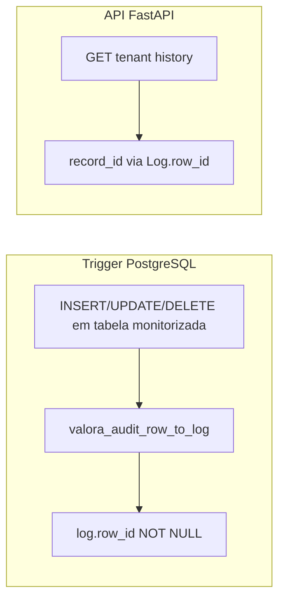

# Plano: `log.row_id` + preenchimento na auditoria

## Onde o log é gravado hoje

Não existe rota FastAPI que faça `INSERT` em `log`. As linhas são criadas **só** pelos triggers `AFTER INSERT OR UPDATE OR DELETE` que chamam [`valora_audit_row_to_log()`](backend/alembic/versions/b6f3a1c9d4e2_log_context_policy_and_history_ids.py), que hoje executa:

```sql
INSERT INTO log (account_id, tenant_id, table_name, action_type, "row")
VALUES (...)
```

O “ajuste da API que grava o log” na prática é **atualizar essa função PL/pgSQL** (e o modelo ORM). A [skill de auditoria](.cursor/skills/audit-log-triggers/SKILL.md) descreve esse contrato; convém atualizá-la após a mudança (comportamento de `row_id`).

## Semântica de `row_id` (contrato fechado)

| Operação | Valor gravado em `row_id` |
|----------|---------------------------|
| **INSERT** | `id` do registro **inserido** (`NEW.id`). |
| **UPDATE** | `id` do registro **atualizado** (`NEW.id`, igual ao da linha antes/depois na mesma PK). |
| **DELETE** | `id` do registro **que está sendo apagado** (`OLD.id`). Em trigger `AFTER DELETE`, a linha já foi removida da tabela alvo, mas `OLD` ainda contém os valores; não é necessário “guardar antes” — `OLD.id` é o valor correto. |

## `row_id` NOT NULL; sem dados legados

- Coluna **`BIGINT NOT NULL`** (sem nullable).
- A tabela **`log` está vazia** no ambiente de referência: **não** é necessário `UPDATE` de backfill nem fase intermédia “add nullable → backfill → set NOT NULL”.
- **Atenção:** em qualquer base que já tenha linhas em `log` antes de aplicar a migração, será preciso truncar/vaciar `log` ou preencher `row_id` antes de aplicar `NOT NULL` — o plano assume `log` vazia.

## 1. Nova revisão Alembic (head atual: `b6f3a1c9d4e2`)

Criar arquivo em [`backend/alembic/versions/`](backend/alembic/versions/) com `down_revision = "b6f3a1c9d4e2"` que:

1. **`op.add_column`** em `log`: `row_id`, `sa.BigInteger()`, **`nullable=False`**, com comentário (identificador da linha na tabela referida por `table_name`).
2. **Substituir** `valora_audit_row_to_log()` copiando o DDL **estrito** atual de [`b6f3a1c9d4e2_log_context_policy_and_history_ids.py`](backend/alembic/versions/b6f3a1c9d4e2_log_context_policy_and_history_ids.py) (`_STRICT_AUDIT_FUNCTION_DDL`) e alterando:
   - Declarar `v_row_id bigint`.
   - Após `v_action` / `v_row`, definir `v_row_id` com ramos explícitos por `TG_OP`: `INSERT`/`UPDATE` → `NEW.id`; `DELETE` → `OLD.id` (não referenciar `NEW` em `DELETE`).
   - `INSERT INTO log (account_id, tenant_id, table_name, action_type, row_id, "row") VALUES (...)`.
3. **`downgrade`:** `op.execute` com a função **sem** `row_id` (corpo idêntico ao atual em `b6f3`) e `op.drop_column("log", "row_id")`.

## 2. Modelo SQLAlchemy

Em [`backend/src/valora_backend/model/log.py`](backend/src/valora_backend/model/log.py), adicionar `row_id: Mapped[int]` com `BIGINT_COMPAT`, **`nullable=False`**, comentário em português do Brasil.

## 3. API de histórico (leitura / diff)

Em [`backend/src/valora_backend/api/auth.py`](backend/src/valora_backend/api/auth.py):

- Incluir `Log.row_id` no `select` de `_build_tenant_history_response` e, se fizer sentido para o contrato público, expor `record_id` ou `row_id` em `TenantHistoryRecordResponse`.
- **Somente `Log.row_id`** como identificador do registro para agrupar updates e percorrer o histórico anterior: **sem** ler `id` de dentro de `row_payload` / JSON. Remover `_extract_log_record_id` (ou deixar de usá-lo) e passar `row_id` explícito nos mapeamentos da query e em `_build_previous_row_payload_by_log_id` (`WHERE` / comparações com `Log.row_id`).
- Stream `prior_log`: filtrar por `Log.row_id == record_id` usando esse inteiro vindo da coluna.

Ajustar o proxy Next se existir tipagem duplicada (ex.: [`frontend/src/app/api/auth/tenant/current/logs/[tableName]/route.ts`](frontend/src/app/api/auth/tenant/current/logs/[tableName]/route.ts)) se o response model ganhar campo novo.

## 4. Testes e seeds

- [`backend/tests/test_audit_triggers_pg.py`](backend/tests/test_audit_triggers_pg.py): após insert/update/delete, `assert row.row_id == <id esperado>`.
- [`backend/tests/test_member_directory_api.py`](backend/tests/test_member_directory_api.py) (`_seed_log` e chamadas): passar **`row_id` obrigatório** coerente com `table_name` / payload.

## 5. Documentação / ERD

- [`backend/erd.json`](backend/erd.json): campo `row_id` já previsto; manter **`notNull: true`** alinhado ao schema.
- Atualizar [`.cursor/skills/audit-log-triggers/SKILL.md`](.cursor/skills/audit-log-triggers/SKILL.md) com a linha sobre `row_id`.

## Fluxo resumido



Nenhuma alteração em `SET LOCAL` / GUCs: `row_id` vem só de `NEW`/`OLD` na trigger.
