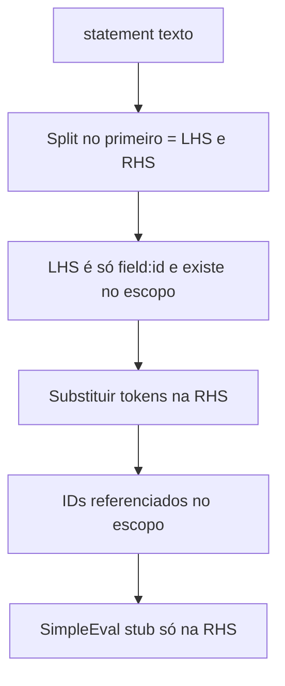

# Validação de fórmulas ao gravar (SimpleEval)

## Contrato confirmado: atribuição

O utilizador **define explicitamente**:

| Parte | Significado | Formato (v1) |
|-------|-------------|----------------|
| **Lado esquerdo (LHS)** | Quem **recebe** o valor calculado | Exclusivamente um token de campo: `${field:<id>}` (após trim, sem texto extra). |
| **Lado direito (RHS)** | **Expressão de cálculo** avaliada pelo SimpleEval | Mesmo texto que hoje o editor grava: referências `${field:id}` no meio de operadores, funções permitidas na lista branca, etc. |

**Separação LHS / RHS (v1):** após `trim` da instrução completa, dividir na **primeira** ocorrência do caractere `=`: tudo antes = alvo; tudo depois = expressão (trim). A RHS em Python/SimpleEval usa `==` para comparações, por isso um único `=` como separador costuma ser suficiente. **Limitação documentada:** se no futuro a expressão precisar de `=` literal (ex. dentro de string), o parser terá de evoluir (reconhecer strings ou um delimitador diferente).

O texto continua a persistir-se como **uma única** `statement` na BD (ex.: `${field:1} = ${field:1} * ${field:2}`), alinhado ao comentário em [Formula.statement](../../backend/src/valora_backend/model/rules.py).

## Resposta direta

**Sim.** Com **SimpleEval** como na skill [rule-formula-simpleeval](../../skills/implementation/rule-formula-simpleeval/SKILL.md), o validador:

1. Faz **parse** da atribuição (LHS + RHS).
2. Valida que o **alvo** existe no escopo e corresponde ao p `${field:id}`.
3. Recolhe todos os `${field:id}` na **RHS**, confirma que existem no escopo.
4. Substitui tokens por nomes seguros em `names` e corre **`eval` só na RHS** com contexto **stub** (valores fictícios), para apanhar **sintaxe inválida** e funções não permitidas.

O **LHS** não precisa de ser avaliado pelo SimpleEval; só validado como alvo permitido.

**Limitações na gravação:** não cobre erros só com dados reais (divisão por zero, etc.). Validação em cadeia (passo 2 usar “resultado” do passo 1) é **fase seguinte**: exige o executor acumular contexto por `step` e, opcionalmente, estender o dry-run com a mesma ordem.

## Estado atual do código

- **Sem `simpleeval` no backend:** não há o pacote em [backend/pyproject.toml](../../backend/pyproject.toml).
- **API sem validação semântica:** [create_scope_action_formula](../../backend/src/valora_backend/api/rules.py) / [patch_scope_action_formula](../../backend/src/valora_backend/api/rules.py) só validam tamanho/não vazio.
- A skill [reference.md](../../skills/implementation/rule-formula-simpleeval/reference.md) mostra **só expressões**; o **executor real** deverá combinar este passo com **pré-processamento** da `statement` (split atribuição, aplicar resultado ao campo alvo). O validador deve ser cópia fiel desse pré-processamento + `eval(RHS)`.

## Abordagem recomendada

1. **Módulo de domínio** (ex.: `backend/src/valora_backend/rules/formula_validate.py`):
   - Parse de atribuição conforme tabela acima; erros estáveis: `formula_invalid_assignment`, `formula_invalid_target`, `formula_unknown_field_id`, `formula_expression_invalid`.
   - **Substituição na RHS** apenas (e validação de tokens no LHS): mapear `${field:id}` → identificadores em `names` (ex.: `f_123`), coerente com o executor.
   - **Dry-run:** `build_evaluator(stub_context)` + `eval(rhs_transformed)`; não avaliar o LHS.

2. **Integração na API:** antes do `commit` em POST/PATCH fórmulas; 422 com **código estável** ([i18n](../../skills/implementation/i18n/SKILL.md)).

3. **Dependência:** `simpleeval` fixado em [backend/pyproject.toml](../../backend/pyproject.toml).

4. **Frontend:** mapear `code` → mensagens em [action-formula-persist](../../frontend/src/lib/configuration/action-formula-persist.ts) / mensagens quando aplicável.

5. **Testes:** assignment mal formada, LHS com texto extra, campo inexistente, RHS sintaxe inválida, função proibida; smoke nos endpoints.

## Evoluções futuras (fora do núcleo v1)

- Atribuição multi-linha ou múltiplas expressões.
- `${input:…}` ou outros alvos se o produto crescer.
- Dry-run **com ordem dos passos** e contexto acumulado (ex.: nomes temporários por passo), alinhado ao motor diário.
