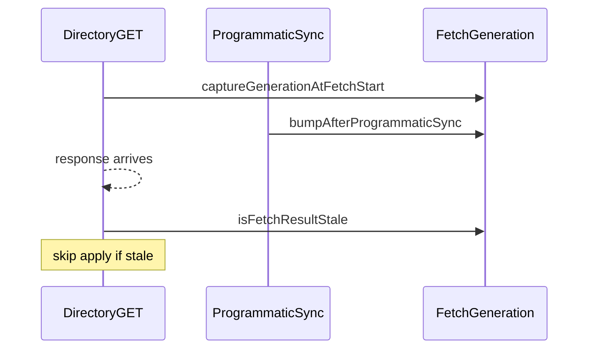

# Padrão: seleção no diretório de configuração (lista + editor)

Referência para telas **diretório + editor** em Configuração (`member`, `action`, `event`, `field`, etc.), onde a lista à esquerda e o formulário ao centro devem permanecer coerentes com a URL e entre si após **Salvar**, **criar** ou **mudar seleção**.

## Objetivo de produto

Após **Salvar** uma **edição** (PATCH), quando o utilizador ainda pode criar ou editar (`can_edit`), o painel deve voltar ao fluxo **novo** (`"new"`, formulário vazio), alinhado ao comportamento do painel de **field**. Se não puder criar, mantém-se o registo em edição.

## Helpers de URL e router

- [`frontend/src/lib/navigation/configuration-path.ts`](../../../frontend/src/lib/navigation/configuration-path.ts)
  - `preferredSelectionKeyAfterEditSave(canEdit, selectedId)` — devolve `"new"` ou o id conforme `can_edit`.
  - `buildConfigurationQueryPath` — preserva parâmetros existentes (ex.: `scope=`) e só altera o parâmetro do diretório (`member`, `action`, `event`, `field`).
  - `urlParamMatchesSelectionKey` — evita `router.replace` quando a query já corresponde à seleção (ordem de parâmetros).
  - `applyConfigurationSelectionToWindowHistory` — `history.replaceState` **síncrono** antes de `setState`, para a barra de endereços não ficar atrás do estado React num remount imediato.

- [`frontend/src/component/configuration/use-replace-configuration-path.ts`](../../../frontend/src/component/configuration/use-replace-configuration-path.ts) — `useLayoutEffect` para alinhar o `router.replace` do Next à URL efetiva.

## Anti-corrida: GET do diretório vs sync após save

Um **GET** do diretório (filtro, refetch) pode **iniciar antes** de um **save** e **terminar depois** da resposta do PATCH. Se o handler do GET chamar `syncFromDirectory` sem validar, o estado volta ao registo antigo ou sobrescreve o modo `"new"`.

**Regra:**

1. Depois de **cada** sincronização **programática** (`syncFromDirectory` disparado por handlers: save bem-sucedido, seleção na lista, “novo”, etc.), chamar `bumpAfterProgrammaticSync()` do hook abaixo.
2. No **início** do `load*Directory` assíncrono, guardar `captureGenerationAtFetchStart()`.
3. Após resposta OK do GET, se `isFetchResultStale(generationAtStart)`, **não** chamar `syncFromDirectory` com o payload desse GET.

Hook: [`frontend/src/component/configuration/use-configuration-directory-fetch-generation.ts`](../../../frontend/src/component/configuration/use-configuration-directory-fetch-generation.ts).

Painéis que combinam `applyConfigurationSelectionToWindowHistory` + `syncFromDirectory` num `applySyncFromHandlers` devem chamar `bumpAfterProgrammaticSync()` **no fim** desse helper (já após `syncFromDirectory`).

## Checklist para um painel novo

1. Parâmetro de query estável para o item selecionado (ex.: `member`, `field`).
2. `useReplaceConfigurationPath` com o `paramName` correto.
3. Em sucesso de mutação, `preferredSelectionKeyAfterEditSave` quando for edição com retorno a `"new"`.
4. `applyConfigurationSelectionToWindowHistory` antes ou dentro do fluxo que atualiza estado após mutação (padrão `applySyncFromHandlers` nos painéis que já o usam).
5. Hook `useConfigurationDirectoryFetchGeneration` ligado ao `load*Directory` e aos pontos de sync programático, conforme a secção anterior.

## Diagrama (geração vs GET tardio)

